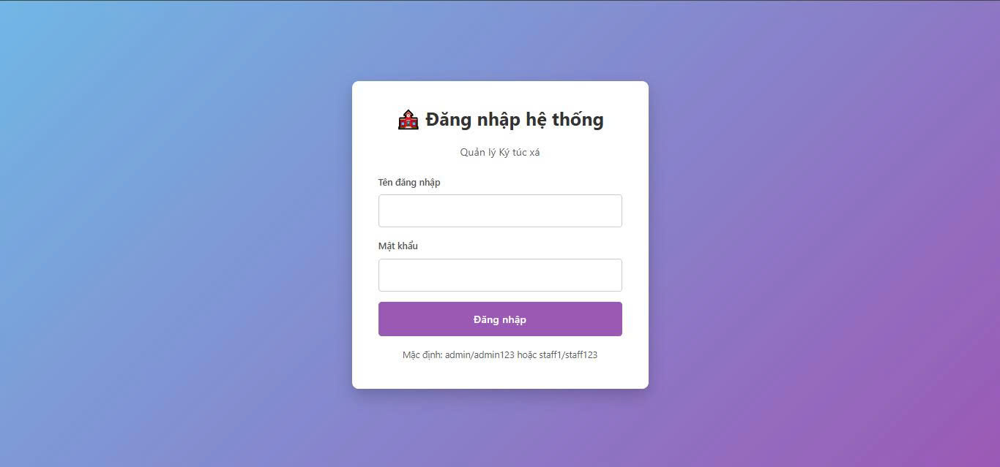
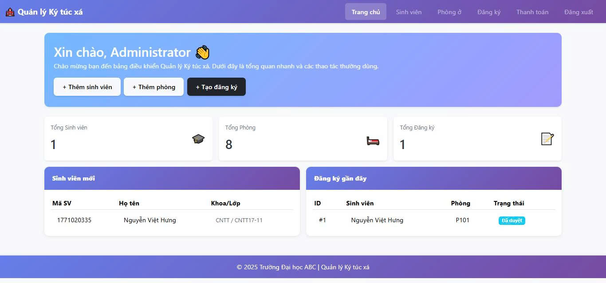
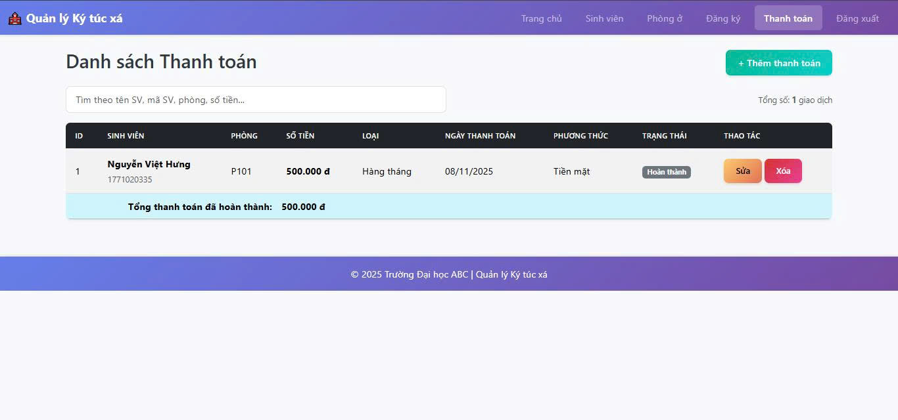
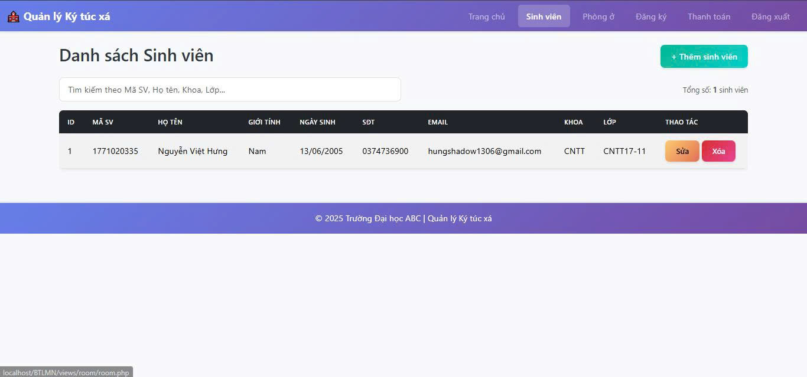

# Hệ thống quản lý kí túc xá sinh viên trường đại học 
## 1. Giới thiệu

Hệ thống được xây dựng bằng ngôn ngữ PHP và cơ sở dữ liệu MySQL, giúp tự động hóa quy trình quản lý, giảm sai sót, tiết kiệm thời gian và nâng cao hiệu quả làm việc.

Việc thực hiện đề tài không chỉ mang lại lợi ích thực tiễn cho công tác quản lý ký túc xá mà còn giúp người phát triển rèn luyện kỹ năng lập trình web, thiết kế cơ sở dữ liệu và xử lý nghiệp vụ quản lý thực tế.

## 2. Các công nghệ được sử dụng

**Hệ điều hành**
<br>


**Công nghệ chính**
<br>


**Web Server & Database**
<br>


## 3. Hình ảnh các chức năng

### Trang đăng nhập


### Trang admin


### Trang thanh toán 


### Trang sinh viên



## 4. Hướng dẫn cài đặt

#### 4.1. Cài đặt công cụ

* Tải và cài đặt XAMPP
* Tải XAMPP tại: [https://www.apachefriends.org/download.html](https://www.apachefriends.org/download.html)
* Cài đặt Visual Studio Code và các extension:
    * PHP Intelephense
    * MySQL
    * Prettier - Code Formatter

### 4.2. Tải project (Clone)

Mở Terminal (dòng lệnh), di chuyển đến thư mục `htdocs` của XAMPP và chạy lệnh sau:

```bash
# Di chuyển vào thư mục htdocs (thay C:\ bằng ổ đĩa của bạn nếu khác)
cd C:\xampp\htdocs

# Clone dự án từ GitHub
git clone [https://github.com/Nguyen-Viet-Viet-Cntt-17-14/quanlydoanto…hub.com/Nguyen-Viet-Viet-Cntt-17-14/quanlydoantotnghiep.git)
```

### 4.3. Cài đặt Database

Mở XAMPP Control Panel, khởi động Apache và MySQL.

Truy cập MySQL Workbench Tạo Database:
```bash
CREATE DATABASE IF NOT EXISTS quan_ly_doan_tot_nghiep
CHARACTER SET utf8mb4
COLLATE utf8mb4_unicode_ci;
```

### 4.4. Setup tham số kết nối

Mở file db_connection.php trong project, chỉnh thông tin DB:

```bash
<?php
$servername = "localhost";
$username = "root";       // Tên đăng nhập CSDL
$password = "";           // Mật khẩu CSDL (mặc định của XAMPP là rỗng)
$dbname = "quan_ly_doan_tot_nghiep"; // **Tên database đã tạo ở Bước 4.3**
$port = 3306;

// Đoạn mã kết nối...
$conn = mysqli_connect($servername, $username, $password, $dbname, $port);

if (!$conn) {
    die("Kết nối database thất bại: " . mysqli_connect_error());
}
mysqli_set_charset($conn, "utf8");
?>
```

### 4.5. Chạy hệ thống

Mở XMAPP Control Panel -> Start Apache và MySQL

Truy cập hệ thống: http://localhost/quanlydoantotnghiep/

## 5. Đăng nhập lần đầu

Hệ thống có sẵn tài khoản quản trị viên (Admin) để bạn đăng nhập và cấu hình ban đầu:

* **Username:** `admin`
* **Password:** `admin123` (Hoặc `123456` - bạn hãy thay đổi cho đúng với dự án của mình)

Sau khi đăng nhập với tư cách Admin, bạn có thể bắt đầu tạo tài khoản cho giảng viên và sinh viên.
